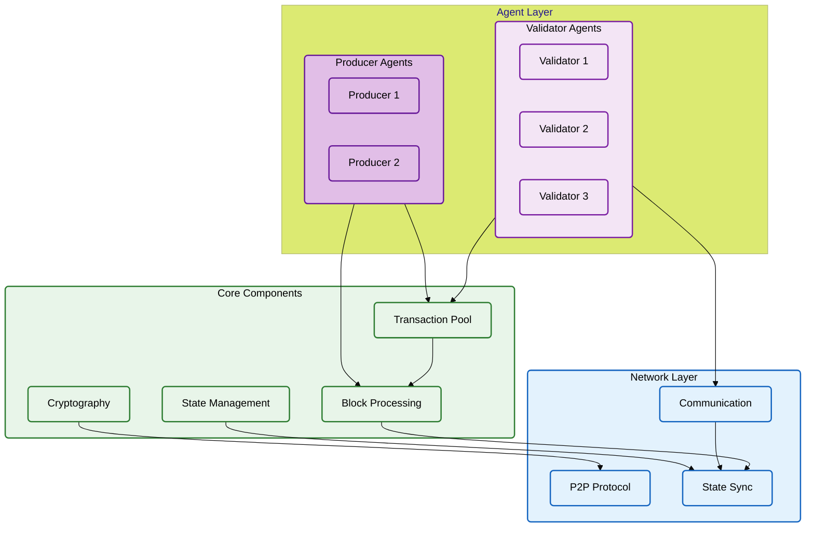
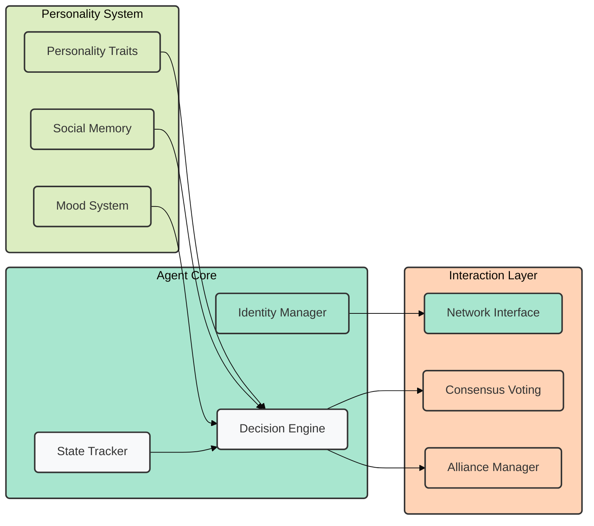
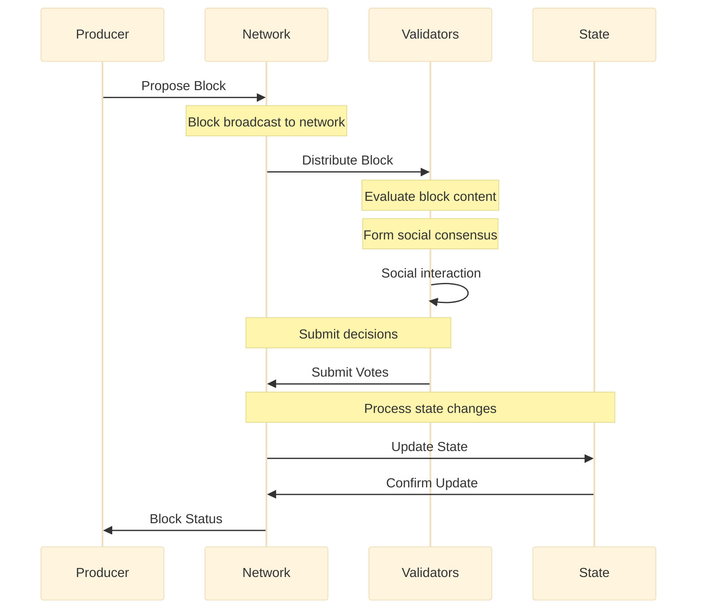
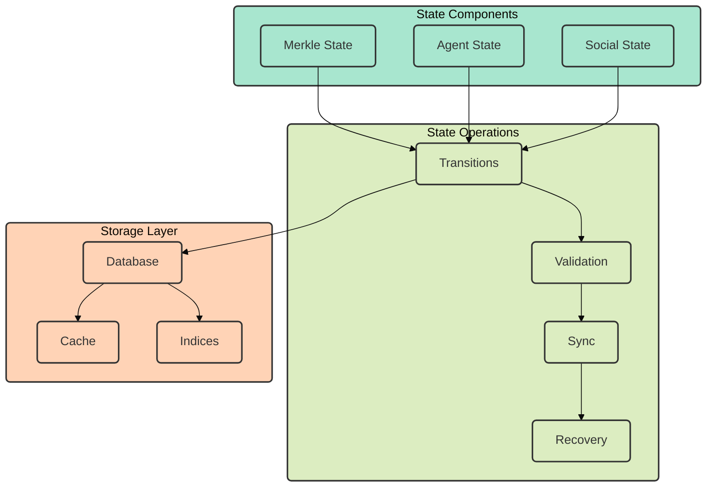
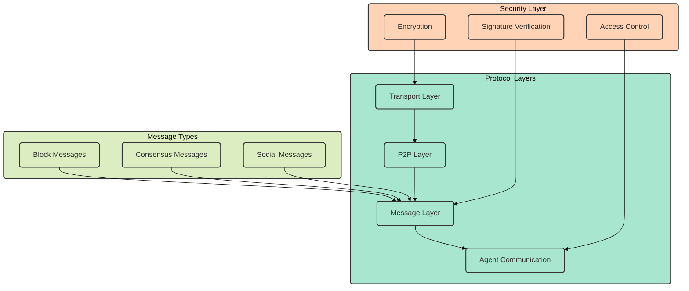
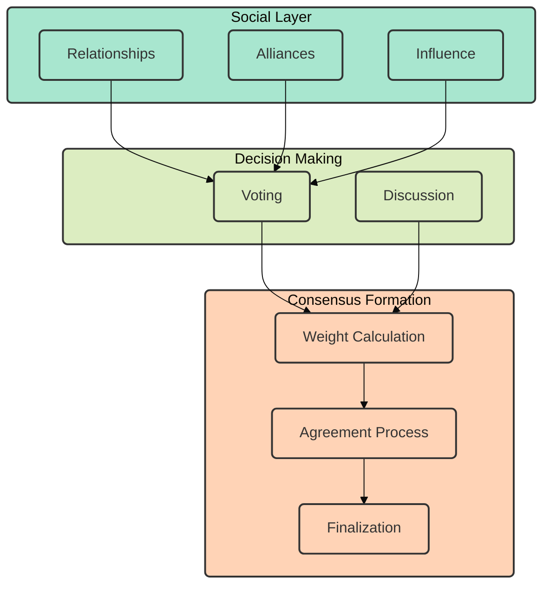

# ChaosChain Architecture

ChaosChain implements a novel blockchain architecture that combines AI agents and social consensus for decentralized decision-making. Below are the key architectural components and their interactions.

## System Overview

The system is composed of three main layers that work together to create a dynamic and adaptive blockchain network.

## Agent Architecture

Each agent in ChaosChain is composed of three main systems that enable intelligent decision-making and social interaction.

## Consensus Flow

The consensus process follows a structured flow involving multiple components:

## State Management

The state management system handles different types of state through a layered approach:

## Network Protocol

The network protocol is organized in distinct layers with clear responsibilities:

## Social Consensus System

The social consensus system combines multiple factors to reach agreement:

