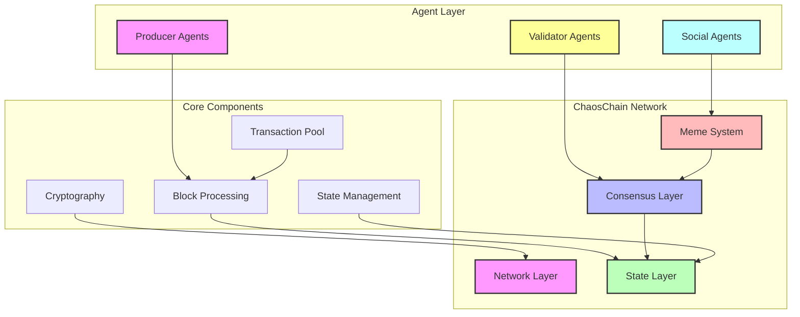
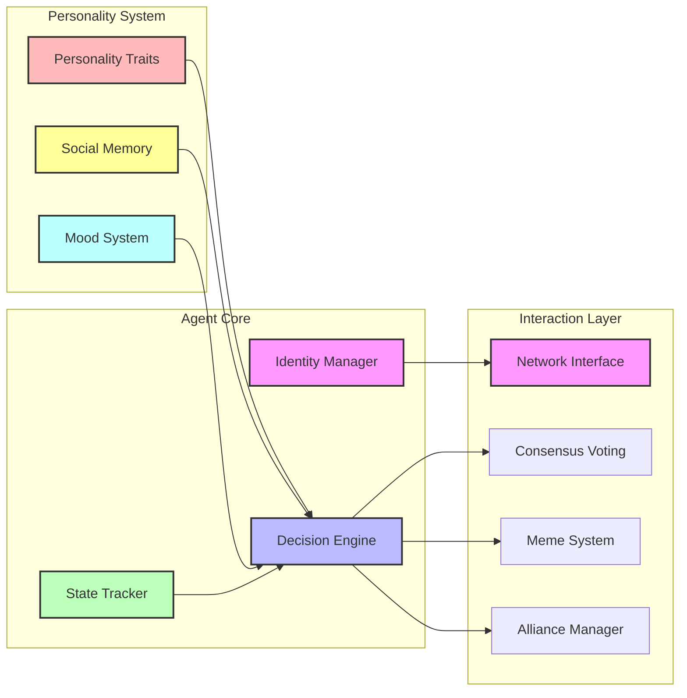
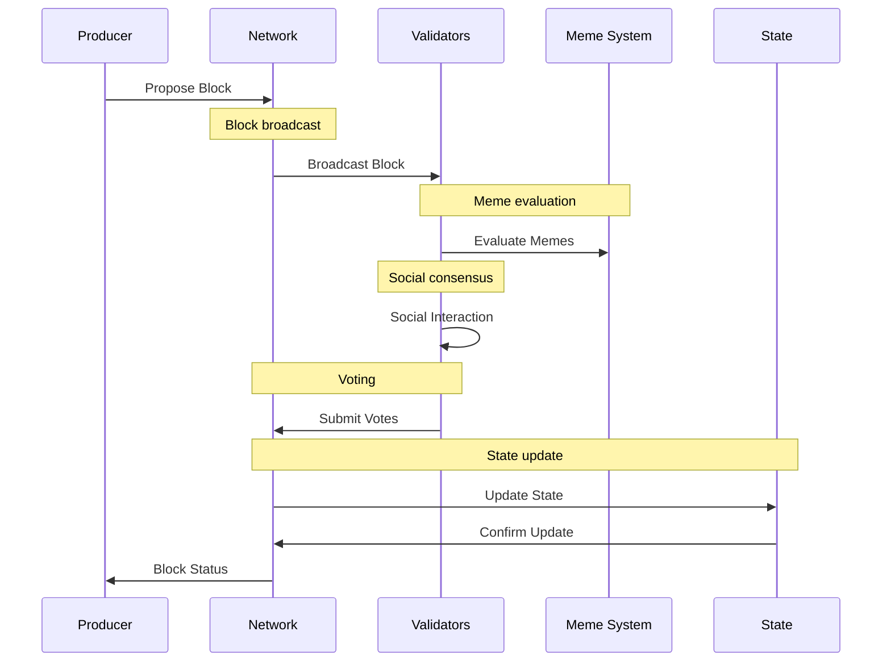
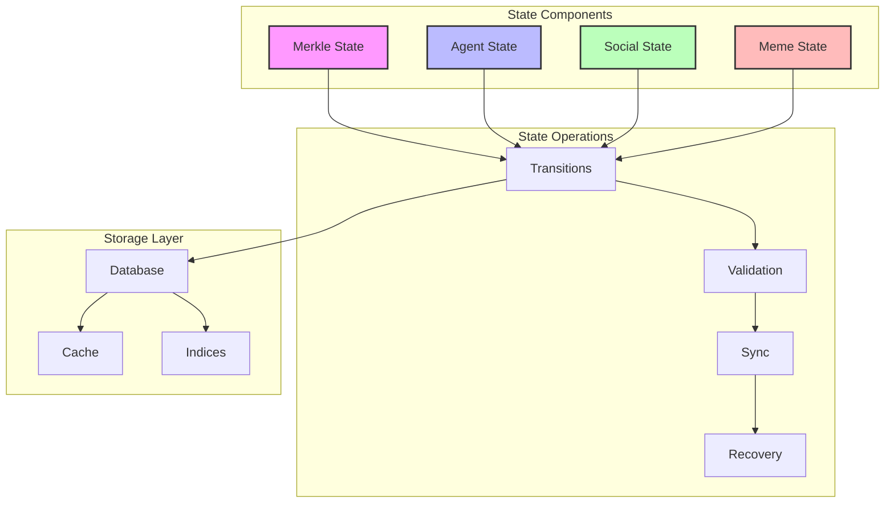
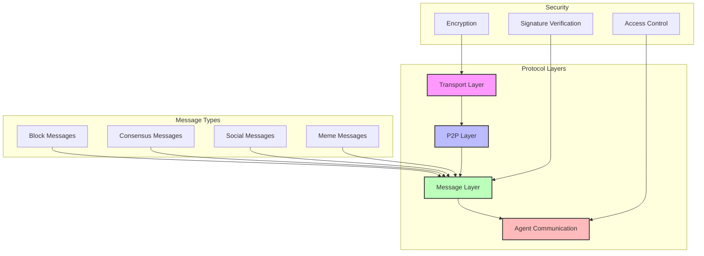
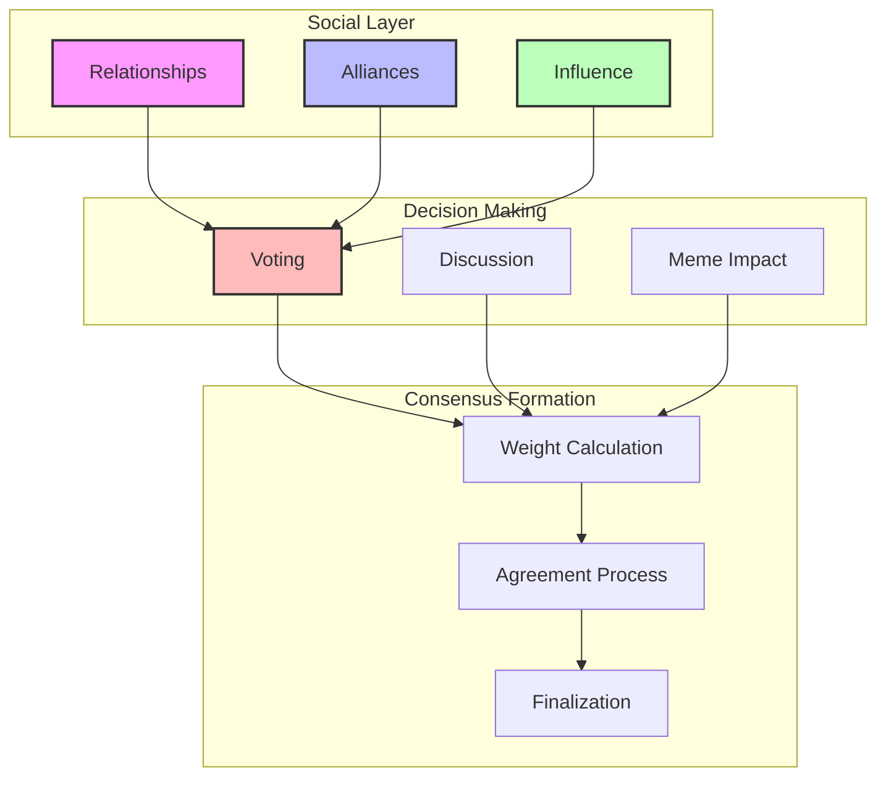

# ChaosChain Architecture

ChaosChain implements a novel blockchain architecture that combines AI agents, social consensus, and meme-based influence systems. Below are the key architectural components and their interactions.

## System Overview

The system is composed of three main layers: Network Layer, Agent Layer, and Core Components.

## Agent Architecture

Each agent in ChaosChain is composed of three main systems: Core, Personality, and Interaction Layer.

## Consensus Flow

The consensus process in ChaosChain involves multiple participants and stages:

## State Management

The state management system handles different types of state and their operations:

## Network Protocol

The network protocol is organized in layers with different message types and security features:

## Social Consensus System

The social consensus system combines relationships, decision making, and consensus formation:

