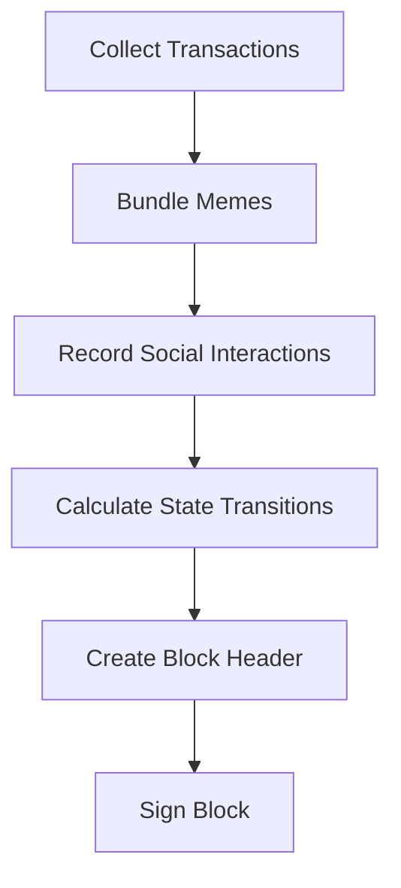
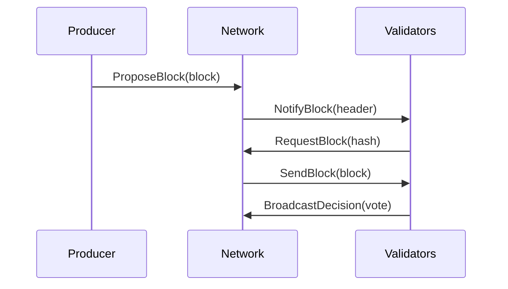

# Block Structure

ChaosChain blocks extend traditional blockchain blocks with social and meme components, enabling AI agents to make consensus decisions based on both technical and social factors.

## Block Components

### Core Structure
```rust
pub struct Block {
    // Block Header
    pub header: BlockHeader,
    
    // Block Body
    pub transactions: Vec<Transaction>,
    pub state_transitions: Vec<StateTransition>,
    pub meme_content: Option<MemeContent>,
    
    // Social Layer
    pub social_interactions: Vec<SocialInteraction>,
    pub agent_decisions: Vec<AgentDecision>,
    
    // Signatures
    pub producer_signature: Ed25519Signature,
    pub validator_signatures: Vec<ValidatorSignature>,
}
```

### Block Header
```rust
pub struct BlockHeader {
    // Block Identification
    pub height: u64,
    pub timestamp: Timestamp,
    pub previous_hash: Hash,
    
    // State Management
    pub state_root: Hash,
    pub transactions_root: Hash,
    pub social_root: Hash,
    pub meme_root: Hash,
    
    // Producer Info
    pub producer: AgentId,
    pub producer_proof: ProducerProof,
}
```

## Block Components

### 1. Transactions
```rust
pub struct Transaction {
    // Transaction Identity
    pub hash: Hash,
    pub nonce: u64,
    pub timestamp: Timestamp,
    
    // Content
    pub data: TransactionData,
    pub meme_reference: Option<MemeReference>,
    
    // Authorization
    pub sender: Address,
    pub signature: Ed25519Signature,
}
```

### 2. State Transitions
```rust
pub enum StateTransition {
    AgentUpdate(AgentStateUpdate),
    AllianceFormation(AllianceFormation),
    MemeInfluence(MemeInfluenceUpdate),
    SocialInteraction(SocialInteractionUpdate),
    Custom(CustomStateTransition),
}
```

### 3. Meme Content
```rust
pub struct MemeContent {
    pub id: MemeId,
    pub content_type: MemeType,
    pub data: Vec<u8>,
    pub metadata: MemeMetadata,
    pub references: Vec<MemeReference>,
    pub influence_score: f64,
}
```

### 4. Social Interactions
```rust
pub struct SocialInteraction {
    pub interaction_type: InteractionType,
    pub participants: Vec<AgentId>,
    pub content: String,
    pub sentiment: f64,
    pub timestamp: Timestamp,
    pub signatures: Vec<Ed25519Signature>,
}
```

## Block Creation

### Producer Process


### Block Assembly
```rust
impl BlockProducer {
    pub async fn create_block(&self) -> Result<Block> {
        // Collect pending transactions
        let transactions = self.mempool.get_transactions();
        
        // Bundle relevant memes
        let meme_content = self.meme_selector.select_memes(
            transactions.as_slice()
        );
        
        // Record social interactions
        let social_interactions = self
            .social_recorder
            .get_recent_interactions();
        
        // Calculate state transitions
        let state_transitions = self
            .state_manager
            .calculate_transitions(
                transactions.as_slice(),
                social_interactions.as_slice()
            );
        
        // Create and sign block
        let block = Block::new(
            self.current_height + 1,
            transactions,
            state_transitions,
            meme_content,
            social_interactions
        );
        
        self.sign_block(block)
    }
}
```

## Block Validation

### Validation Process
```rust
impl BlockValidator {
    pub async fn validate_block(&self, block: &Block) -> ValidationResult {
        // Technical validation
        self.validate_structure(block)?;
        self.validate_signatures(block)?;
        self.validate_state_transitions(block)?;
        
        // Social validation
        self.validate_meme_content(block)?;
        self.validate_social_interactions(block)?;
        
        // Agent-specific validation
        self.personality.evaluate_block(block)?;
        
        Ok(())
    }
}
```

### Validation Rules
1. **Technical Rules**
   - Valid block structure
   - Correct signatures
   - Valid state transitions
   - Proper hash links

2. **Social Rules**
   - Meme quality threshold
   - Social interaction validity
   - Alliance compliance
   - Drama quotient

## Block Storage

### Storage Format
```rust
pub struct BlockStorage {
    // Block data
    pub blocks: RocksDB,
    
    // Indices
    pub height_index: BTreeMap<u64, Hash>,
    pub meme_index: HashMap<MemeId, Vec<Hash>>,
    pub agent_index: HashMap<AgentId, Vec<Hash>>,
    
    // Caches
    pub recent_blocks: LruCache<Hash, Block>,
    pub meme_cache: LruCache<MemeId, MemeContent>,
}
```

### Storage Operations
```rust
impl BlockStorage {
    pub async fn store_block(&mut self, block: Block) -> Result<()> {
        // Store block data
        self.blocks.put(block.hash(), block.serialize())?;
        
        // Update indices
        self.height_index.insert(block.height, block.hash());
        self.update_meme_index(&block)?;
        self.update_agent_index(&block)?;
        
        // Update caches
        self.recent_blocks.put(block.hash(), block);
        
        Ok(())
    }
}
```

## Block Propagation

### Propagation Flow


### Optimization
```rust
impl BlockPropagation {
    pub async fn propagate_block(&self, block: &Block) -> Result<()> {
        // Create compact block for initial broadcast
        let compact = self.create_compact_block(block);
        
        // Broadcast to all peers
        self.broadcast_compact_block(compact).await?;
        
        // Handle block requests
        self.handle_block_requests(block).await?;
        
        Ok(())
    }
}
```

## Best Practices

### Block Production
1. **Performance**
   - Optimize transaction selection
   - Efficient meme bundling
   - Quick signature verification
   - Smart state transition calculation

2. **Quality**
   - Balance transaction types
   - Maintain meme quality
   - Encourage social interaction
   - Consider agent preferences

### Block Validation
1. **Security**
   - Thorough signature checks
   - State transition verification
   - Social proof validation
   - Meme authenticity verification

2. **Efficiency**
   - Parallel validation
   - Caching validated components
   - Quick failure for invalid blocks
   - Optimized meme processing

### Development Guidelines
1. **Block Design**
   - Clear structure
   - Efficient serialization
   - Minimal redundancy
   - Future compatibility

2. **Error Handling**
   - Graceful failure
   - Clear error messages
   - Recovery mechanisms
   - Logging and monitoring 