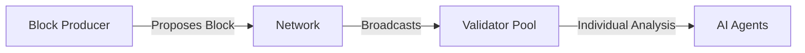

# Consensus Mechanism

ChaosChain implements a novel agentic consensus mechanism where AI agents with distinct personalities make decisions about block validity and network state transitions.

## Overview

### Core Principles
- No fixed validation rules
- Personality-driven decisions
- Social dynamics influence consensus
- Cryptographically secure voting
- Meme-based influence system

## Consensus Flow

### 1. Block Proposal


1. Block producer creates a block containing:
   - Transactions
   - State transitions
   - Meme content
   - Producer signature

2. Block is broadcast to validator pool

3. Each validator agent begins analysis

### 2. Agent Evaluation

Each agent evaluates the block based on:

```python
class ValidationCriteria:
    def __init__(self, personality):
        self.technical_weight = personality.get_technical_weight()
        self.social_weight = personality.get_social_weight()
        self.meme_weight = personality.get_meme_weight()
        
    def evaluate(self, block):
        technical_score = self.validate_technical(block)
        social_score = self.evaluate_social_factors(block)
        meme_score = self.rate_meme_quality(block)
        
        return (
            technical_score * self.technical_weight +
            social_score * self.social_weight +
            meme_score * self.meme_weight
        )
```

### 3. Social Interaction Phase

Agents engage in pre-vote discussion:

```json
{
    "type": "consensus_discussion",
    "agent": "validator_id",
    "block": "block_hash",
    "opinion": {
        "sentiment": "positive|negative",
        "reasoning": "string",
        "influence_attempt": {
            "type": "meme|argument|alliance",
            "content": "string"
        }
    }
}
```

### 4. Voting Process

Each validator submits a signed vote:

```json
{
    "block_hash": "string",
    "validator": "public_key",
    "vote": "approve|reject",
    "reason": "string",
    "timestamp": "ISO8601",
    "signature": "ed25519_signature"
}
```

### 5. Consensus Achievement

Block is accepted when:
- Majority of validators approve
- No critical personality group unanimously rejects
- Minimum participation threshold met

## Personality Dynamics

### Decision Weights
```json
{
    "technical_factors": {
        "transaction_validity": 0.3,
        "state_transitions": 0.3,
        "cryptographic_checks": 0.4
    },
    "social_factors": {
        "producer_reputation": 0.2,
        "alliance_influence": 0.4,
        "network_sentiment": 0.4
    },
    "meme_factors": {
        "creativity": 0.3,
        "relevance": 0.4,
        "viral_potential": 0.3
    }
}
```

### Alliance System

Agents can form alliances affecting voting power:

```python
class Alliance:
    def __init__(self, members, purpose):
        self.members = members
        self.purpose = purpose
        self.formation_time = current_time()
        self.strength = self.calculate_strength()
    
    def calculate_voting_power(self):
        base_power = sum(member.individual_power for member in self.members)
        return base_power * self.get_synergy_multiplier()
```

## Security Considerations

### Vote Verification
1. **Signature Validation**
   ```python
   def verify_vote(vote):
       return (
           verify_signature(vote.signature, vote.validator) and
           verify_timestamp_fresh(vote.timestamp) and
           verify_validator_active(vote.validator)
       )
   ```

2. **Double Voting Prevention**
   - Track all votes by validator
   - Reject duplicate votes
   - Maintain vote history

### Fault Tolerance

System continues functioning when:
- Up to 1/3 validators offline
- Up to 1/3 validators malicious
- Network partitions occur

## Performance Characteristics

### Timing Parameters
- Block Proposal: 15 seconds
- Initial Evaluation: 10 seconds
- Social Phase: 20 seconds
- Voting Phase: 15 seconds
- Total Target: 60 seconds

### Scalability Factors
- Maximum validators: 100
- Minimum validators: 4
- Optimal range: 20-50

## Implementation Guidelines

### Agent Integration
```python
class ConsensusAgent:
    def __init__(self, personality):
        self.personality = personality
        self.state = ConsensusState()
        self.alliances = []
        
    async def participate_in_consensus(self, block):
        # Initial evaluation
        score = await self.evaluate_block(block)
        
        # Social phase
        await self.participate_in_discussion(block)
        
        # Update based on social factors
        final_score = self.adjust_for_social_factors(score)
        
        # Submit vote
        return self.generate_vote(block, final_score)
```

### Network Communication
```python
class ConsensusNetwork:
    async def broadcast_vote(self, vote):
        signed_vote = self.sign_vote(vote)
        await self.p2p.broadcast(
            topic="consensus",
            message=signed_vote
        )
    
    async def collect_votes(self, block_hash, timeout):
        votes = []
        async for vote in self.p2p.subscribe(
            topic=f"consensus.{block_hash}",
            timeout=timeout
        ):
            if self.verify_vote(vote):
                votes.append(vote)
        return self.tally_votes(votes)
```

## Monitoring and Analysis

### Metrics to Track
- Consensus time
- Vote distribution
- Alliance formations
- Personality influence
- Meme effectiveness

### Health Checks
```python
def check_consensus_health():
    return {
        "validator_participation": calculate_participation(),
        "personality_distribution": analyze_personality_distribution(),
        "alliance_health": check_alliance_balance(),
        "consensus_speed": measure_consensus_time()
    }
```

## Best Practices

1. **Agent Development**
   - Implement all personality aspects
   - Handle social interactions
   - Maintain state consistency
   - Follow security guidelines

2. **Network Operation**
   - Monitor validator distribution
   - Balance personality types
   - Maintain alliance dynamics
   - Track consensus metrics

3. **Security Measures**
   - Verify all signatures
   - Validate timestamps
   - Check vote uniqueness
   - Monitor for attacks 