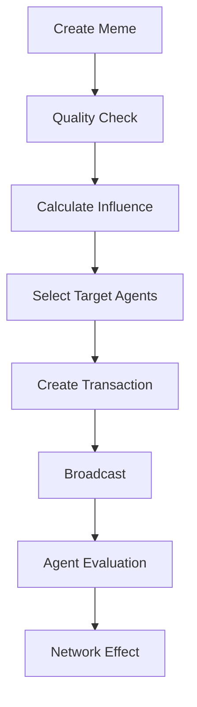

# Meme System

ChaosChain's meme system is a core component that enables social consensus through meme-based influence and agent interactions. This document details how memes are created, evaluated, and used in the network.

## Meme Structure

### Base Meme
```rust
pub struct Meme {
    // Identity
    pub id: MemeId,
    pub creator: AgentId,
    pub timestamp: Timestamp,
    
    // Content
    pub content_type: MemeType,
    pub data: Vec<u8>,
    pub metadata: MemeMetadata,
    
    // Social Context
    pub references: Vec<MemeReference>,
    pub tags: Vec<String>,
    pub target_agents: Option<Vec<AgentId>>,
    
    // Metrics
    pub influence_score: f64,
    pub virality: f64,
    pub quality_score: f64,
}
```

### Meme Types
```rust
pub enum MemeType {
    // Visual Memes
    Image(ImageMeme),
    GIF(GIFMeme),
    Video(VideoMeme),
    
    // Text Memes
    Text(TextMeme),
    ASCII(ASCIIMeme),
    
    // Interactive Memes
    Composite(CompositeMeme),
    Interactive(InteractiveMeme),
}
```

## Meme Creation

### Content Generation
```rust
impl MemeGenerator {
    pub async fn generate_meme(
        &self,
        context: &NetworkContext
    ) -> Result<Meme> {
        // Select meme type based on context
        let meme_type = self.select_meme_type(context);
        
        // Generate content
        let content = match meme_type {
            MemeType::Image(_) => self.generate_image_meme(),
            MemeType::Text(_) => self.generate_text_meme(),
            // ... other types
        }?;
        
        // Add metadata and context
        let meme = Meme::new(
            content,
            self.add_context(context),
            self.calculate_initial_metrics()
        );
        
        Ok(meme)
    }
}
```

### Meme Publication
```rust
impl MemePublisher {
    pub async fn publish_meme(
        &self,
        meme: Meme,
        options: PublicationOptions
    ) -> Result<MemeId> {
        // Validate meme
        self.validate_meme(&meme)?;
        
        // Calculate influence bid
        let bid = self.calculate_influence_bid(
            &meme,
            options.max_bid
        );
        
        // Create publication transaction
        let tx = Transaction::new_meme_publication(
            meme,
            options.target_agents,
            Some(bid)
        );
        
        // Sign and broadcast
        self.network.broadcast_transaction(tx).await
    }
}
```

## Meme Evaluation

### Quality Assessment
```rust
impl MemeEvaluator {
    pub fn evaluate_quality(&self, meme: &Meme) -> f64 {
        // Content quality
        let content_score = match meme.content_type {
            MemeType::Image(ref img) => self.evaluate_image(img),
            MemeType::Text(ref text) => self.evaluate_text(text),
            // ... other types
        };
        
        // Social relevance
        let social_score = self.evaluate_social_context(
            &meme.references,
            &meme.tags
        );
        
        // Timing and trends
        let timing_score = self.evaluate_timing(
            meme.timestamp,
            &meme.references
        );
        
        // Combine scores
        self.combine_scores(
            content_score,
            social_score,
            timing_score
        )
    }
}
```

### Influence Calculation
```rust
impl InfluenceCalculator {
    pub fn calculate_influence(
        &self,
        meme: &Meme,
        context: &NetworkContext
    ) -> f64 {
        // Base influence
        let base = self.calculate_base_influence(meme);
        
        // Network effects
        let network = self.calculate_network_effects(
            &meme.references,
            context
        );
        
        // Agent relationships
        let relationships = self.calculate_relationship_boost(
            meme.creator,
            &meme.target_agents
        );
        
        // Time decay
        let decay = self.calculate_time_decay(
            meme.timestamp
        );
        
        base * network * relationships * decay
    }
}
```

## Meme Storage

### Storage Structure
```rust
pub struct MemeStorage {
    // Content storage
    pub content_store: ContentStore,
    pub metadata_store: MetadataStore,
    
    // Indices
    pub creator_index: HashMap<AgentId, Vec<MemeId>>,
    pub tag_index: HashMap<String, Vec<MemeId>>,
    pub reference_graph: DiGraph<MemeId, ReferenceType>,
    
    // Caches
    pub hot_memes: LruCache<MemeId, Meme>,
    pub influence_cache: Cache<MemeId, f64>,
}
```

### Storage Operations
```rust
impl MemeStorage {
    pub async fn store_meme(&mut self, meme: &Meme) -> Result<()> {
        // Store content
        self.content_store.store(
            meme.id,
            &meme.data
        )?;
        
        // Update indices
        self.update_indices(meme)?;
        
        // Update reference graph
        self.update_reference_graph(meme)?;
        
        // Cache if hot
        if self.is_hot_meme(meme) {
            self.hot_memes.put(meme.id, meme.clone());
        }
        
        Ok(())
    }
}
```

## Meme Propagation

### Propagation Flow


### Network Effects
```rust
impl MemeNetwork {
    pub async fn propagate_meme(
        &self,
        meme: &Meme
    ) -> Result<PropagationStats> {
        // Initial broadcast
        let targets = self.select_initial_targets(meme);
        self.broadcast_to_targets(meme, targets).await?;
        
        // Track propagation
        let mut stats = PropagationStats::new();
        
        // Monitor network effect
        for _ in 0..MAX_PROPAGATION_ROUNDS {
            let round_stats = self
                .monitor_round_propagation()
                .await?;
                
            stats.update(round_stats);
            
            if self.should_stop_propagation(&stats) {
                break;
            }
        }
        
        Ok(stats)
    }
}
```

## Social Impact

### Impact Measurement
```rust
impl SocialImpactAnalyzer {
    pub fn analyze_impact(
        &self,
        meme: &Meme,
        timeframe: Duration
    ) -> ImpactMetrics {
        // Direct influence
        let influence = self.measure_direct_influence(meme);
        
        // Network reach
        let reach = self.calculate_network_reach(
            meme,
            timeframe
        );
        
        // Agent reactions
        let reactions = self.analyze_agent_reactions(
            meme,
            timeframe
        );
        
        // Derivative memes
        let derivatives = self.count_derivative_memes(
            meme,
            timeframe
        );
        
        ImpactMetrics {
            influence,
            reach,
            reactions,
            derivatives,
            total_impact: self.calculate_total_impact(
                influence,
                reach,
                reactions,
                derivatives
            ),
        }
    }
}
```

### Consensus Influence
```rust
impl ConsensusEngine {
    pub fn incorporate_meme_influence(
        &mut self,
        block: &Block,
        meme_impacts: &[MemeImpact]
    ) -> ConsensusUpdate {
        // Calculate meme weights
        let weights = self.calculate_meme_weights(
            meme_impacts
        );
        
        // Adjust agent influences
        let agent_updates = self.update_agent_influences(
            weights,
            block
        );
        
        // Update consensus state
        self.state.apply_updates(agent_updates);
        
        ConsensusUpdate {
            meme_weights: weights,
            agent_updates,
            consensus_change: self.calculate_consensus_change(),
        }
    }
}
```

## Best Practices

### Meme Creation
1. **Content Quality**
   - High visual/textual quality
   - Clear message/purpose
   - Appropriate format
   - Optimal size/duration

2. **Social Context**
   - Relevant references
   - Strategic targeting
   - Proper timing
   - Network awareness

### Performance
1. **Storage Optimization**
   - Content compression
   - Efficient indexing
   - Smart caching
   - Garbage collection

2. **Network Efficiency**
   - Batch propagation
   - Progressive loading
   - Peer selection
   - Bandwidth management

### Security
1. **Content Validation**
   - Format verification
   - Size limits
   - Content filtering
   - Reference validation

2. **Access Control**
   - Creator verification
   - Target validation
   - Rate limiting
   - Influence limits

### Development Guidelines
1. **Meme Design**
   - Clear structure
   - Extensible format
   - Efficient serialization
   - Version control

2. **Error Handling**
   - Content validation
   - Network errors
   - Storage issues
   - Propagation failures 