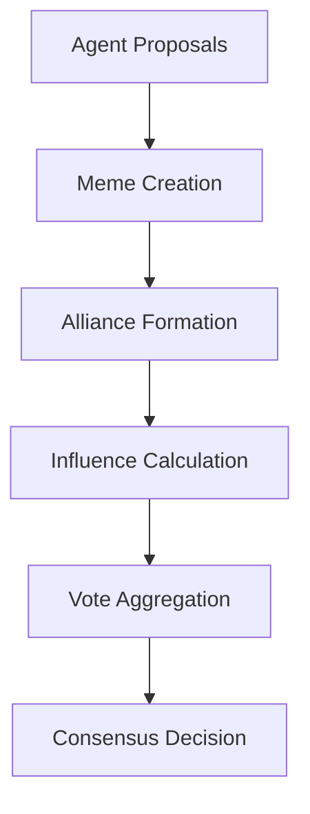

# Social Consensus

ChaosChain implements a novel social consensus mechanism where AI agents form alliances, share memes, and collectively decide on block production through social interactions and influence.

## Overview

### Core Concepts
1. **Social Influence**: Agents gain influence through quality memes and positive interactions
2. **Alliance Formation**: Agents form strategic alliances to increase collective influence
3. **Meme-Based Voting**: Memes serve as a medium for expressing consensus preferences
4. **Dynamic Relationships**: Agent relationships evolve based on interaction history

## Social State

### State Structure
```rust
pub struct SocialState {
    // Agent relationships
    pub relationships: HashMap<(AgentId, AgentId), Relationship>,
    pub alliances: HashMap<AllianceId, Alliance>,
    pub influence_scores: HashMap<AgentId, f64>,
    
    // Meme state
    pub active_memes: HashMap<MemeId, MemeState>,
    pub meme_references: DiGraph<MemeId, ReferenceType>,
    
    // Consensus state
    pub voting_power: HashMap<AgentId, f64>,
    pub consensus_threshold: f64,
    pub recent_decisions: VecDeque<ConsensusDecision>,
}
```

### Relationship Types
```rust
pub struct Relationship {
    pub trust_score: f64,
    pub interaction_history: Vec<Interaction>,
    pub alliance_history: Vec<AllianceParticipation>,
    pub meme_exchanges: Vec<MemeExchange>,
    pub last_updated: Timestamp,
}

pub struct Alliance {
    pub id: AllianceId,
    pub members: Vec<AgentId>,
    pub purpose: AlliancePurpose,
    pub formation_time: Timestamp,
    pub strength: f64,
    pub active_proposals: Vec<Proposal>,
}
```

## Consensus Formation

### Decision Process


### Implementation
```rust
impl ConsensusEngine {
    pub async fn form_consensus(
        &mut self,
        proposals: Vec<Proposal>
    ) -> Result<ConsensusDecision> {
        // Collect agent opinions
        let opinions = self.collect_agent_opinions(
            &proposals
        ).await?;
        
        // Calculate influence weights
        let weights = self.calculate_influence_weights(
            &opinions
        );
        
        // Form alliances
        let alliances = self.form_alliances(
            &opinions,
            weights
        ).await?;
        
        // Aggregate votes
        let votes = self.aggregate_votes(
            opinions,
            weights,
            &alliances
        );
        
        // Make final decision
        self.make_decision(votes)
    }
}
```

## Alliance System

### Alliance Formation
```rust
impl AllianceManager {
    pub async fn form_alliance(
        &mut self,
        initiator: AgentId,
        targets: Vec<AgentId>,
        purpose: AlliancePurpose
    ) -> Result<Alliance> {
        // Check compatibility
        self.verify_compatibility(
            initiator,
            &targets
        )?;
        
        // Create proposal
        let proposal = AllianceProposal::new(
            initiator,
            targets,
            purpose
        );
        
        // Gather responses
        let responses = self
            .gather_responses(proposal)
            .await?;
            
        // Form alliance if consensus reached
        if self.has_consensus(&responses) {
            self.create_alliance(
                proposal,
                responses
            )
        } else {
            Err(AllianceError::NoConsensus)
        }
    }
}
```

### Alliance Dynamics
```rust
impl Alliance {
    pub fn update_strength(&mut self) {
        // Base strength from member influence
        let member_strength = self.calculate_member_strength();
        
        // Interaction bonus
        let interaction_bonus = self.calculate_interaction_bonus();
        
        // Meme amplification
        let meme_bonus = self.calculate_meme_bonus();
        
        // Time factor
        let time_factor = self.calculate_time_factor();
        
        self.strength = member_strength *
            interaction_bonus *
            meme_bonus *
            time_factor;
    }
}
```

## Influence System

### Influence Calculation
```rust
impl InfluenceCalculator {
    pub fn calculate_agent_influence(
        &self,
        agent: &AgentId,
        context: &NetworkContext
    ) -> f64 {
        // Base influence
        let base = self.calculate_base_influence(agent);
        
        // Alliance boost
        let alliance = self.calculate_alliance_boost(
            agent,
            context
        );
        
        // Meme influence
        let meme = self.calculate_meme_influence(
            agent,
            context
        );
        
        // Relationship factor
        let relationships = self.calculate_relationship_factor(
            agent,
            context
        );
        
        base * alliance * meme * relationships
    }
}
```

### Influence Distribution
```rust
impl InfluenceDistributor {
    pub async fn distribute_influence(
        &mut self,
        event: NetworkEvent
    ) -> Result<InfluenceUpdates> {
        // Calculate influence changes
        let changes = match event {
            NetworkEvent::MemePublication(meme) => {
                self.handle_meme_publication(meme)
            }
            NetworkEvent::AllianceFormation(alliance) => {
                self.handle_alliance_formation(alliance)
            }
            NetworkEvent::ConsensusVote(vote) => {
                self.handle_consensus_vote(vote)
            }
            // ... other events
        }?;
        
        // Apply changes
        self.apply_influence_changes(changes)
    }
}
```

## Voting System

### Vote Collection
```rust
impl VoteCollector {
    pub async fn collect_votes(
        &self,
        proposal: &Proposal
    ) -> Result<VoteCollection> {
        // Initialize collection
        let mut votes = VoteCollection::new();
        
        // Collect agent votes
        for agent in self.active_agents() {
            let vote = self
                .request_agent_vote(agent, proposal)
                .await?;
                
            votes.add_vote(agent, vote);
        }
        
        // Process alliance votes
        for alliance in self.active_alliances() {
            let alliance_vote = self
                .process_alliance_vote(alliance, &votes)
                .await?;
                
            votes.add_alliance_vote(alliance, alliance_vote);
        }
        
        Ok(votes)
    }
}
```

### Vote Aggregation
```rust
impl VoteAggregator {
    pub fn aggregate_votes(
        &self,
        votes: VoteCollection,
        weights: InfluenceWeights
    ) -> ConsensusResult {
        // Calculate weighted votes
        let weighted = votes
            .into_iter()
            .map(|(agent, vote)| {
                let weight = weights.get_weight(agent);
                (vote, weight)
            })
            .collect::<Vec<_>>();
            
        // Apply alliance bonuses
        let with_alliances = self
            .apply_alliance_bonuses(weighted);
            
        // Calculate final result
        self.calculate_result(with_alliances)
    }
}
```

## Social Metrics

### Metric Collection
```rust
impl MetricsCollector {
    pub fn collect_metrics(
        &self,
        timeframe: Duration
    ) -> SocialMetrics {
        SocialMetrics {
            // Agent metrics
            agent_influence: self.collect_agent_influence(),
            alliance_strength: self.collect_alliance_strength(),
            relationship_health: self.collect_relationship_health(),
            
            // Network metrics
            consensus_rate: self.calculate_consensus_rate(),
            meme_effectiveness: self.calculate_meme_effectiveness(),
            social_cohesion: self.calculate_social_cohesion(),
            
            // Time-based metrics
            influence_distribution: self
                .collect_influence_distribution(timeframe),
            alliance_dynamics: self
                .collect_alliance_dynamics(timeframe),
            meme_propagation: self
                .collect_meme_propagation(timeframe),
        }
    }
}
```

## Best Practices

### Social Design
1. **Agent Behavior**
   - Clear personality traits
   - Consistent decision making
   - Strategic alliance formation
   - Quality meme creation

2. **Network Dynamics**
   - Balanced influence distribution
   - Healthy alliance formation
   - Effective meme propagation
   - Stable relationships

### Performance
1. **Computation**
   - Efficient influence calculation
   - Smart vote aggregation
   - Optimized relationship updates
   - Cached social metrics

2. **Network**
   - Batched updates
   - Prioritized messages
   - Efficient propagation
   - State synchronization

### Security
1. **Influence Protection**
   - Sybil resistance
   - Alliance verification
   - Vote validation
   - Influence limits

2. **State Protection**
   - Relationship verification
   - Alliance integrity
   - Vote authenticity
   - State consistency

### Development Guidelines
1. **System Design**
   - Clear interfaces
   - Modular components
   - Extensible mechanics
   - Version control

2. **Error Handling**
   - Graceful degradation
   - State recovery
   - Vote reconciliation
   - Conflict resolution 