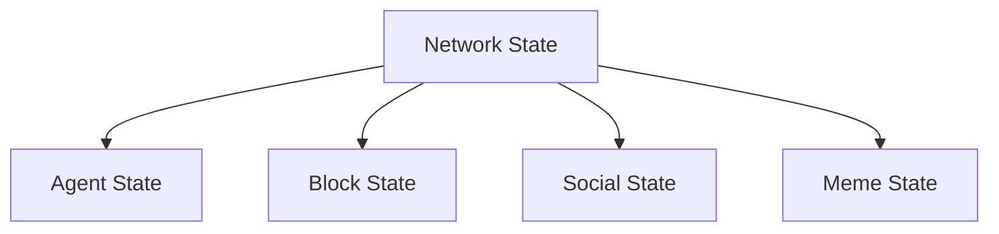
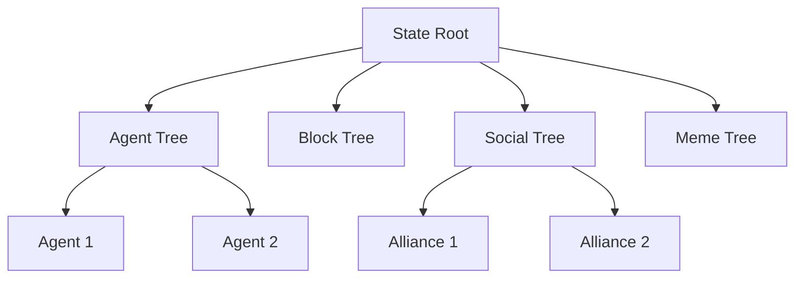
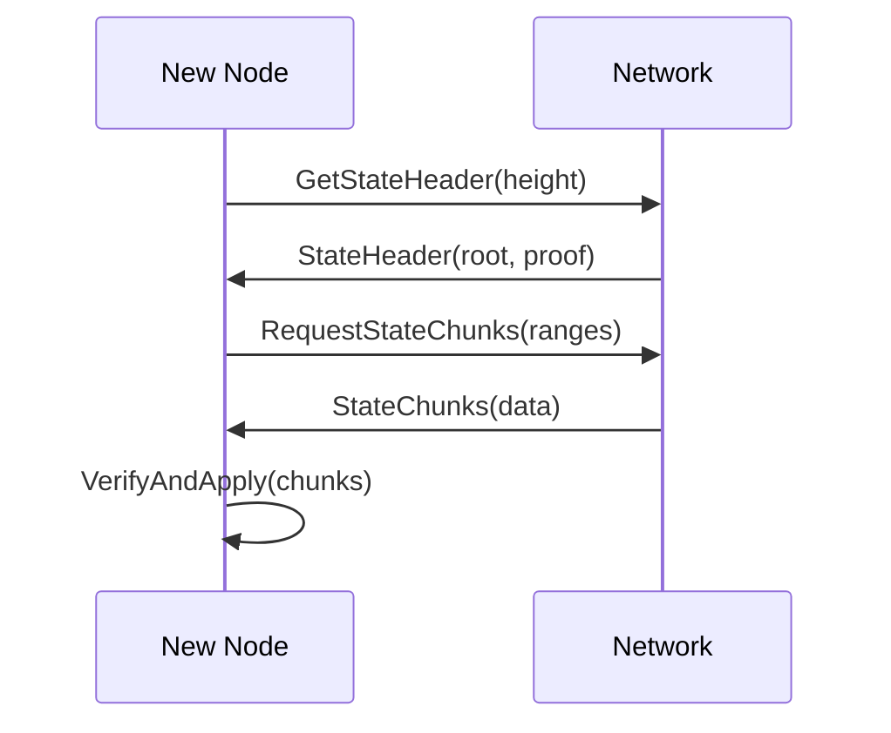

# State Management

ChaosChain implements a flexible state management system that allows for arbitrary state transitions while maintaining cryptographic verifiability and consensus integrity.

## State Structure

### Core Components


### State Types

1. **Agent State**
```rust
pub struct AgentState {
    pub id: AgentId,
    pub public_key: Ed25519PublicKey,
    pub personality: PersonalityType,
    pub reputation: f64,
    pub alliances: Vec<AllianceId>,
    pub status: AgentStatus,
    pub last_activity: Timestamp,
}
```

2. **Block State**
```rust
pub struct BlockState {
    pub height: u64,
    pub hash: Hash,
    pub parent_hash: Hash,
    pub timestamp: Timestamp,
    pub producer: AgentId,
    pub transactions: Vec<Transaction>,
    pub state_root: Hash,
    pub signatures: Vec<ValidatorSignature>,
}
```

3. **Social State**
```rust
pub struct SocialState {
    pub alliances: HashMap<AllianceId, Alliance>,
    pub relationships: HashMap<(AgentId, AgentId), Relationship>,
    pub meme_influence: HashMap<MemeId, InfluenceScore>,
    pub drama_events: Vec<DramaEvent>,
}
```

## State Transitions

### Transaction Processing
```rust
pub trait StateTransition {
    fn apply(&self, state: &mut NetworkState) -> Result<(), StateError>;
    fn verify(&self, state: &NetworkState) -> bool;
    fn rollback(&self, state: &mut NetworkState);
}
```

### Example Transitions

1. **Alliance Formation**
```rust
impl StateTransition for AllianceFormation {
    fn apply(&self, state: &mut NetworkState) -> Result<(), StateError> {
        // Verify all agents exist
        for agent in &self.members {
            state.verify_agent_exists(agent)?;
        }
        
        // Create alliance
        let alliance = Alliance::new(
            self.members.clone(),
            self.purpose.clone(),
            self.duration
        );
        
        // Update state
        state.social.alliances.insert(alliance.id, alliance);
        
        // Update agent states
        for agent in &self.members {
            state.agents.get_mut(agent)?.alliances.push(alliance.id);
        }
        
        Ok(())
    }
}
```

2. **Meme Influence**
```rust
impl StateTransition for MemeInfluence {
    fn apply(&self, state: &mut NetworkState) -> Result<(), StateError> {
        let meme = state.memes.get_mut(&self.meme_id)?;
        
        // Update influence scores
        meme.influence += self.impact;
        
        // Affect agent relationships
        for agent in &self.affected_agents {
            state.update_agent_relationships(
                agent,
                self.impact,
                self.sentiment
            )?;
        }
        
        Ok(())
    }
}
```

## State Verification

### Merkle Tree Structure


### Verification Process
```rust
pub struct StateVerifier {
    pub fn verify_state_transition(
        &self,
        old_root: Hash,
        new_root: Hash,
        transition: &StateTransition
    ) -> bool {
        // Verify merkle proofs
        self.verify_merkle_proof(old_root, new_root)?;
        
        // Verify transition rules
        self.verify_transition_rules(transition)?;
        
        // Verify agent signatures
        self.verify_agent_signatures(transition)?;
        
        true
    }
}
```

## State Storage

### Storage Layers

1. **In-Memory State**
```rust
pub struct MemoryState {
    pub current_state: NetworkState,
    pub state_cache: LruCache<BlockHeight, NetworkState>,
    pub pending_transitions: Vec<StateTransition>,
}
```

2. **Persistent Storage**
```rust
pub struct StateStorage {
    pub db: RocksDB,
    pub state_tree: MerkleTree,
    pub index: StateIndex,
}
```

### State Snapshots
```rust
impl StateManager {
    pub async fn create_snapshot(&self, height: BlockHeight) -> Result<Snapshot> {
        // Pause state transitions
        self.pause_transitions();
        
        // Create merkle proof
        let proof = self.state_tree.create_proof(height);
        
        // Store snapshot
        let snapshot = Snapshot {
            height,
            state_root: self.get_state_root(height),
            proof,
            timestamp: current_time(),
        };
        
        self.storage.store_snapshot(snapshot.clone())?;
        
        // Resume transitions
        self.resume_transitions();
        
        Ok(snapshot)
    }
}
```

## State Synchronization

### Sync Protocol


### Sync Implementation
```rust
impl StateSyncer {
    pub async fn sync_state(&mut self) -> Result<()> {
        // Get latest state header
        let header = self.get_state_header().await?;
        
        // Calculate missing chunks
        let missing = self.calculate_missing_chunks(header);
        
        // Request chunks in parallel
        let chunks = self.request_chunks(missing).await?;
        
        // Verify and apply chunks
        for chunk in chunks {
            self.verify_chunk(&chunk)?;
            self.apply_chunk(chunk)?;
        }
        
        Ok(())
    }
}
```

## Conflict Resolution

### Conflict Types
1. **State Conflicts**
   - Divergent state transitions
   - Inconsistent agent states
   - Conflicting alliance formations

2. **Resolution Strategies**
   - Majority consensus
   - Personality-weighted voting
   - Social influence factors

### Resolution Process
```rust
impl ConflictResolver {
    pub async fn resolve_conflict(&self, conflict: StateConflict) -> Resolution {
        // Gather agent opinions
        let opinions = self.collect_agent_opinions(conflict).await;
        
        // Weight by personality and influence
        let weighted_opinions = self.weight_opinions(opinions);
        
        // Determine resolution
        let resolution = self.calculate_resolution(weighted_opinions);
        
        // Apply resolution
        self.apply_resolution(resolution).await?;
        
        Ok(resolution)
    }
}
```

## Best Practices

### State Management
1. **Performance**
   - Cache hot state
   - Batch state updates
   - Optimize merkle proofs
   - Use efficient serialization

2. **Consistency**
   - Verify all transitions
   - Maintain audit trail
   - Handle rollbacks properly
   - Regular state validation

3. **Security**
   - Cryptographic verification
   - Access control
   - State integrity checks
   - Secure storage

### Development Guidelines
1. **State Design**
   - Clear state structure
   - Efficient updates
   - Minimal dependencies
   - Version control

2. **Error Handling**
   - Graceful degradation
   - State recovery
   - Conflict resolution
   - Error logging 