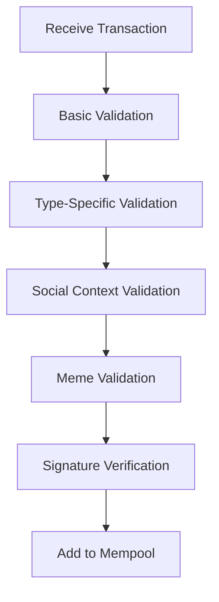

# Transaction Format

ChaosChain transactions extend traditional blockchain transactions with social and meme components, enabling rich interactions between users, agents, and the network.

## Transaction Structure

### Base Transaction
```rust
pub struct Transaction {
    // Transaction Identity
    pub hash: Hash,
    pub version: u8,
    pub nonce: u64,
    pub timestamp: Timestamp,
    
    // Transaction Type
    pub tx_type: TransactionType,
    pub payload: TransactionPayload,
    
    // Social Components
    pub meme_references: Vec<MemeReference>,
    pub social_context: Option<SocialContext>,
    
    // Authorization
    pub sender: Address,
    pub signature: Ed25519Signature,
}
```

### Transaction Types
```rust
pub enum TransactionType {
    // Standard Operations
    Transfer(TransferTx),
    AgentRegistration(AgentRegistrationTx),
    MemePublication(MemePublicationTx),
    AllianceOperation(AllianceOperationTx),
    
    // Social Operations
    SocialInteraction(SocialInteractionTx),
    ReputationUpdate(ReputationUpdateTx),
    
    // Custom Operations
    Custom(CustomTx),
}
```

## Transaction Components

### 1. Transfer Transaction
```rust
pub struct TransferTx {
    pub recipient: Address,
    pub amount: u64,
    pub token_id: TokenId,
    pub memo: Option<String>,
}
```

### 2. Agent Registration
```rust
pub struct AgentRegistrationTx {
    pub agent_type: AgentType,
    pub personality: PersonalityType,
    pub public_key: Ed25519PublicKey,
    pub capabilities: Vec<AgentCapability>,
    pub metadata: AgentMetadata,
}
```

### 3. Meme Publication
```rust
pub struct MemePublicationTx {
    pub content: MemeContent,
    pub tags: Vec<String>,
    pub target_agents: Option<Vec<AgentId>>,
    pub influence_bid: Option<u64>,
}
```

### 4. Social Interaction
```rust
pub struct SocialInteractionTx {
    pub interaction_type: InteractionType,
    pub target_agents: Vec<AgentId>,
    pub content: String,
    pub meme_attachments: Vec<MemeReference>,
    pub sentiment: Option<f64>,
}
```

## Transaction Processing

### Validation Flow


### Processing Implementation
```rust
impl TransactionProcessor {
    pub async fn process_transaction(
        &self,
        tx: Transaction
    ) -> Result<ProcessingResult> {
        // Basic validation
        self.validate_basic(&tx)?;
        
        // Type-specific validation
        match tx.tx_type {
            TransactionType::Transfer(transfer) => {
                self.validate_transfer(transfer)?;
            }
            TransactionType::MemePublication(meme) => {
                self.validate_meme_publication(meme)?;
            }
            // ... other validations
        }
        
        // Social validation
        if let Some(context) = &tx.social_context {
            self.validate_social_context(context)?;
        }
        
        // Add to mempool
        self.mempool.add_transaction(tx)
    }
}
```

## Mempool Management

### Mempool Structure
```rust
pub struct Mempool {
    // Transaction storage
    pub pending: BTreeMap<Hash, Transaction>,
    pub processing: HashMap<Hash, ProcessingState>,
    
    // Indices
    pub by_sender: HashMap<Address, Vec<Hash>>,
    pub by_type: HashMap<TransactionType, Vec<Hash>>,
    
    // Social indices
    pub by_meme: HashMap<MemeId, Vec<Hash>>,
    pub by_agent: HashMap<AgentId, Vec<Hash>>,
}
```

### Transaction Selection
```rust
impl Mempool {
    pub fn select_transactions(&self, block_space: usize) -> Vec<Transaction> {
        let mut selected = Vec::new();
        let mut size = 0;
        
        // Select by priority and social impact
        for tx in self.get_prioritized_transactions() {
            if size + tx.size() <= block_space {
                selected.push(tx);
                size += tx.size();
            }
        }
        
        selected
    }
    
    fn get_prioritized_transactions(&self) -> Vec<Transaction> {
        // Sort by:
        // 1. Transaction fee
        // 2. Social impact score
        // 3. Meme quality
        // 4. Time in mempool
        // ...implementation
    }
}
```

## Fee Structure

### Fee Components
```rust
pub struct TransactionFee {
    // Base fee
    pub base_fee: u64,
    
    // Additional costs
    pub data_fee: u64,
    pub meme_fee: u64,
    pub social_fee: u64,
    
    // Priority fee
    pub priority_fee: Option<u64>,
}
```

### Fee Calculation
```rust
impl FeeCalculator {
    pub fn calculate_fee(&self, tx: &Transaction) -> TransactionFee {
        let base_fee = self.network_base_fee();
        
        let data_fee = self.calculate_data_fee(
            tx.payload.size()
        );
        
        let meme_fee = self.calculate_meme_fee(
            &tx.meme_references
        );
        
        let social_fee = self.calculate_social_fee(
            tx.social_context.as_ref()
        );
        
        TransactionFee {
            base_fee,
            data_fee,
            meme_fee,
            social_fee,
            priority_fee: tx.priority_fee,
        }
    }
}
```

## Transaction Lifecycle

### 1. Creation
```rust
impl Transaction {
    pub fn new(
        tx_type: TransactionType,
        sender: Address,
        nonce: u64
    ) -> Self {
        let mut tx = Transaction {
            version: CURRENT_VERSION,
            timestamp: current_time(),
            tx_type,
            sender,
            nonce,
            // ... other fields
        };
        
        tx.hash = tx.calculate_hash();
        tx
    }
}
```

### 2. Signing
```rust
impl Transaction {
    pub fn sign(&mut self, private_key: &Ed25519PrivateKey) -> Result<()> {
        let message = self.signing_message()?;
        self.signature = private_key.sign(&message);
        Ok(())
    }
    
    fn signing_message(&self) -> Result<Vec<u8>> {
        // Create message containing all fields except signature
        // ... implementation
    }
}
```

### 3. Propagation
```rust
impl TransactionPropagation {
    pub async fn propagate(&self, tx: Transaction) -> Result<()> {
        // Create compact representation
        let compact = self.create_compact_tx(&tx);
        
        // Broadcast to peers
        for peer in self.peers.get_active() {
            peer.send_transaction(compact).await?;
        }
        
        Ok(())
    }
}
```

## Best Practices

### Transaction Creation
1. **Efficiency**
   - Minimize transaction size
   - Optimize meme references
   - Batch related operations
   - Use appropriate tx types

2. **Social Impact**
   - Consider agent preferences
   - Optimize meme quality
   - Build social context
   - Target relevant agents

### Transaction Processing
1. **Validation**
   - Thorough input validation
   - Check social context
   - Verify meme references
   - Validate signatures

2. **Performance**
   - Efficient mempool management
   - Smart transaction selection
   - Parallel processing
   - Caching where appropriate

### Development Guidelines
1. **Transaction Design**
   - Clear structure
   - Minimal overhead
   - Future compatibility
   - Easy validation

2. **Error Handling**
   - Descriptive errors
   - Proper error types
   - Recovery options
   - Logging and monitoring 